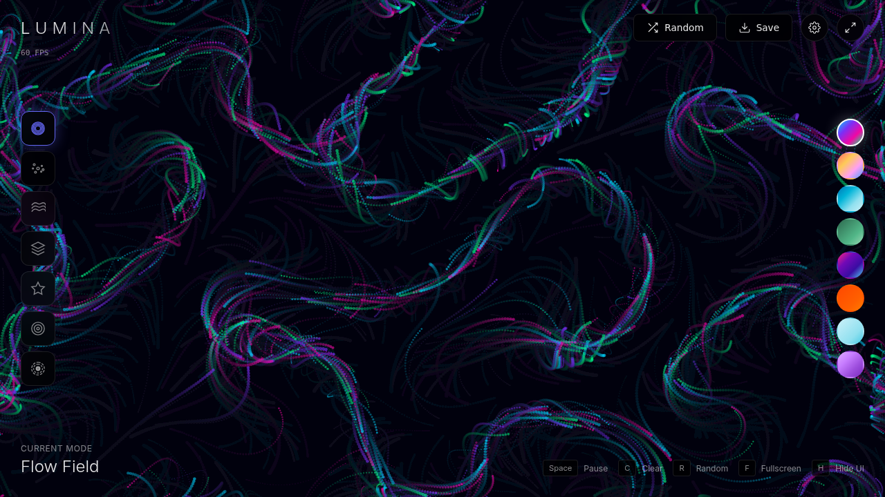
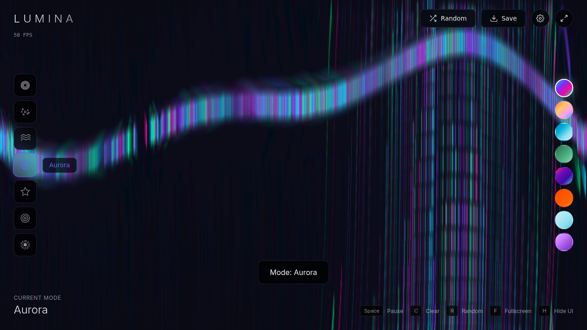

# Lumina

**Interactive Generative Art**

A beautiful, browser-based generative art experience built with vanilla HTML5 Canvas and JavaScript. Create mesmerizing particle animations with multiple visualization modes and color palettes.

## [Live Demo](https://matthewpdingle.github.io/Lumina/)

## Features

### 7 Visualization Modes
- **Flow Field** - Perlin noise-driven particle streams
- **Particles** - Orbital spiral motion around center
- **Waves** - Rippling wave patterns
- **Aurora** - Northern lights effect with vertical gradient streaks
- **Constellation** - Stars with connecting network lines
- **Nebula** - Spiral galaxy effect
- **Gravity Well** - Three orbiting gravity centers creating mesmerizing spirals

### 8 Color Palettes
Aurora, Sunset, Ocean, Forest, Neon, Ember, Arctic, Lavender

### Interactive Features
- Real-time FPS counter
- Randomize button for instant variety
- Settings panel (particle count, speed, trail length, mouse influence)
- Mouse/touch interaction affects particles
- Save artwork as PNG
- Fullscreen mode
- Hide UI for clean screenshots

### Keyboard Shortcuts
| Key | Action |
|-----|--------|
| `Space` | Pause/Resume |
| `C` | Clear canvas |
| `R` | Randomize everything |
| `F` | Toggle fullscreen |
| `H` | Hide/show UI |
| `1-7` | Switch visualization modes |
| `Ctrl+S` | Save image |

## Usage

Simply open `index.html` in a modern web browser. No build process or dependencies required.

Or serve locally:
```bash
python3 -m http.server 8080
# Then open http://localhost:8080
```

## Screenshots

| Flow Field | Gravity Well |
|:---:|:---:|
|  |  |

| Aurora | Constellation |
|:---:|:---:|
|  |  |

## License

MIT

---

*Created with Claude Opus 4.5*
